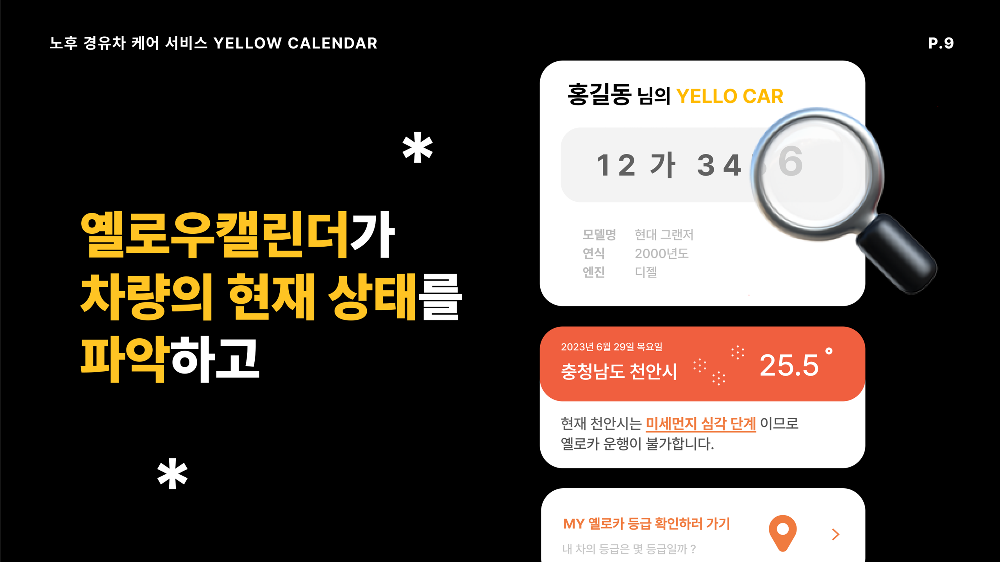
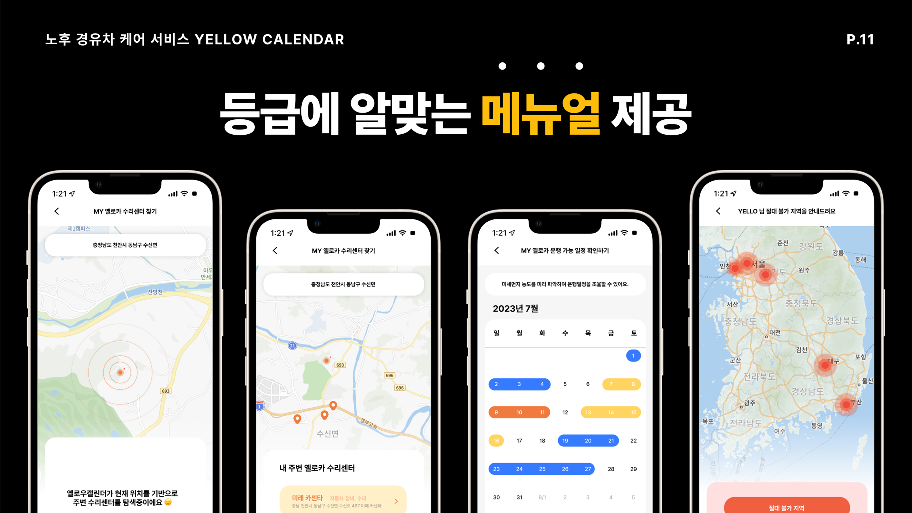

 
  
SW 중심대학 공동해커톤
# YELLOW CALENDAR
🚕노후 경유차 케어 서비스🚕

## BACKGROUND

**노후 경유차, 언제든 자유롭게 탈 수 있어!**

### 노후 경유차란?

> 전국 등록 차량 약 2300만 대 중 약 270만대가 '노후 경유차'

고농도의 미세먼지를 배출하는 경유차.  
환경부에서 대기오염을 막기 위해 차량 출고시 등급을 매기도록 하였으며,  
가장 많은 미세먼지를 배출하는 5등급 차량부터 노후경유차로 지정하여 조기폐차를 권고하고 있는 중.

### 노후 경유차의 운행 제한

1. 12월 ~ 3월 미세먼지 계절관리제  
   : 전국 5등급 차량 중 저공해 미조치 차량이 단속 대상. 평일 6~21시까지 시행
2. 고농도 미세먼지(PM2.5)가 예측되는 경우 지자체장의 권한으로 비상저감조치 발령  
   : 5등급 차량의 운행 제한
3. 한양도성 내부 (16.7km^2)를 연중 상시 6~21시 5등급 차량의 운행 제한
4. 서울, 인천, 경기 노후경유차 운행 제한

### INSIGHT

> 현재 소유중인 노후 경유차의 갑작스런 폐차 권고, 폐차를 하지 않고, 벌금도 안내면서 탈 수 있는 방법이 없을까?

- 오랫동안 운행한 차를 폐차 하는 아쉬움 + 폐차 권고로 인한 절망감 + 계속해서 발생하는 벌금

→ 노후 경유차 제도로 인한 불편함(운행 제한)을 해소하는 서비스를 기획하자!

## SERVICE

### IDEA

1. 운행 가능 여부 확인 서비스 제공  
   : 내가 갈 수 있는 지역, 못 가는 지역, 지역별로 갈 수 있는지 없는지 정보를 제공함.
2. 차량 상태에 따른 케어 서비스 제공  
   : 차를 유지할 수 있도록 차량 관리를 도움
   - 차량 등급을 바탕으로 차량 상태 파악
   - 근처 카센터 위치 제공
   - 차량 상태 확인 후 운행 제한 조건에 해당할 경우 폐차 안내

### UI

|                      |                      |
| -------------------- | -------------------- |
|  |  |
|  |  |

## 기대효과

1. 새로운 사용자 유입  
   : 260만 이상의 차주들을 대상으로 벌금을 내지 않게 도와 불안감을 해소해줌으로써 새로운 사용자 유입이 우선적 목표
2. 이익 창출  
   : 향후 업데이트를 통해 노후경유차일 경우 필요한 점검, 부품들을 판매 하여 이익 창출 가능.
3. 다양한 플랫폼으로 성장가능성  
   : 단속지역에서 낮은 가격에 팔리는 노후경유차를 싼가격에 매입하여 비단속 지역이나, 자주 단속하지 않는 지역에 판매하여 시세의 차익을 챙길 수 있음.  
   : 판매가 힘들었던 노후경유차를 쉽게 판매할 수 있는 기회를 제공.
